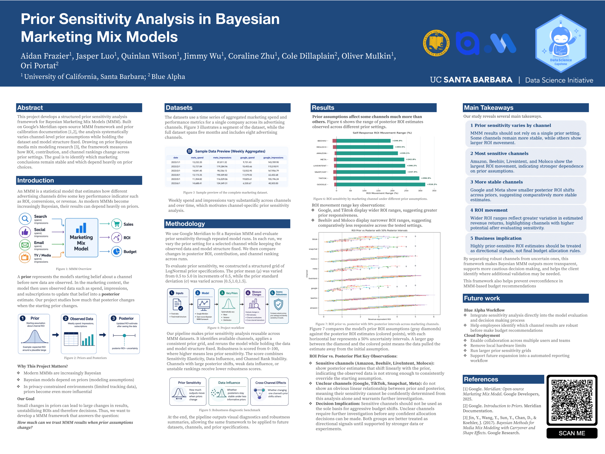
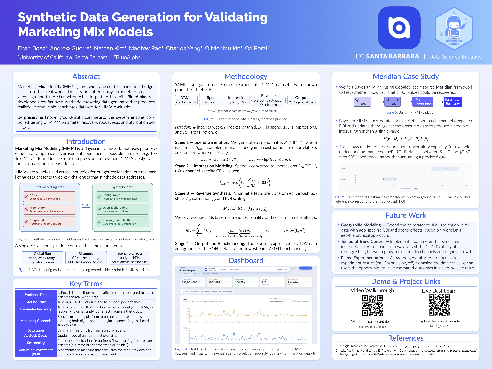
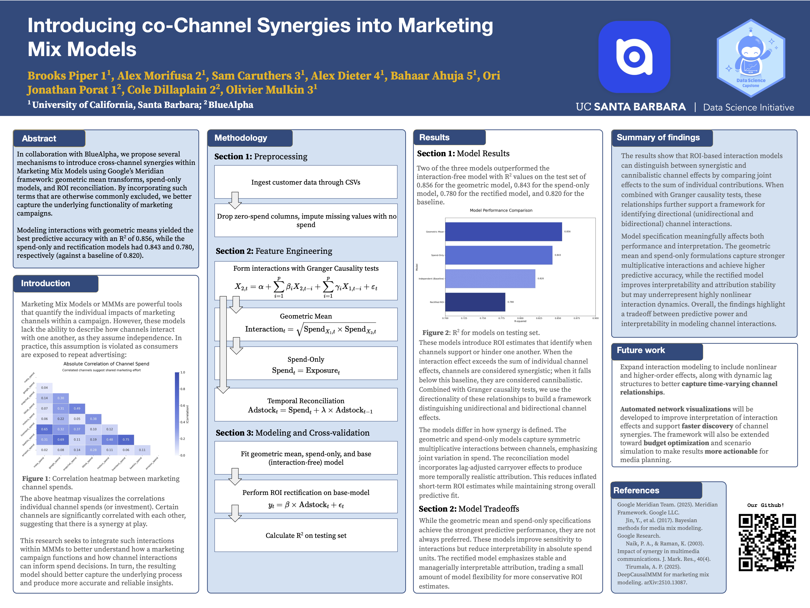
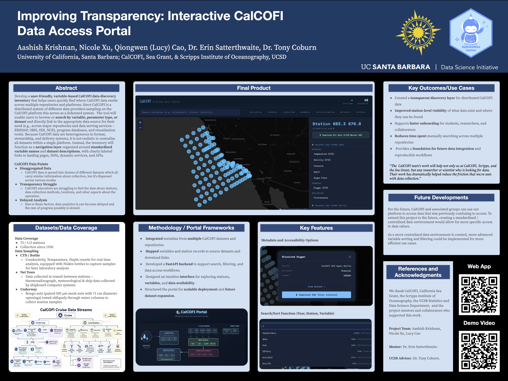
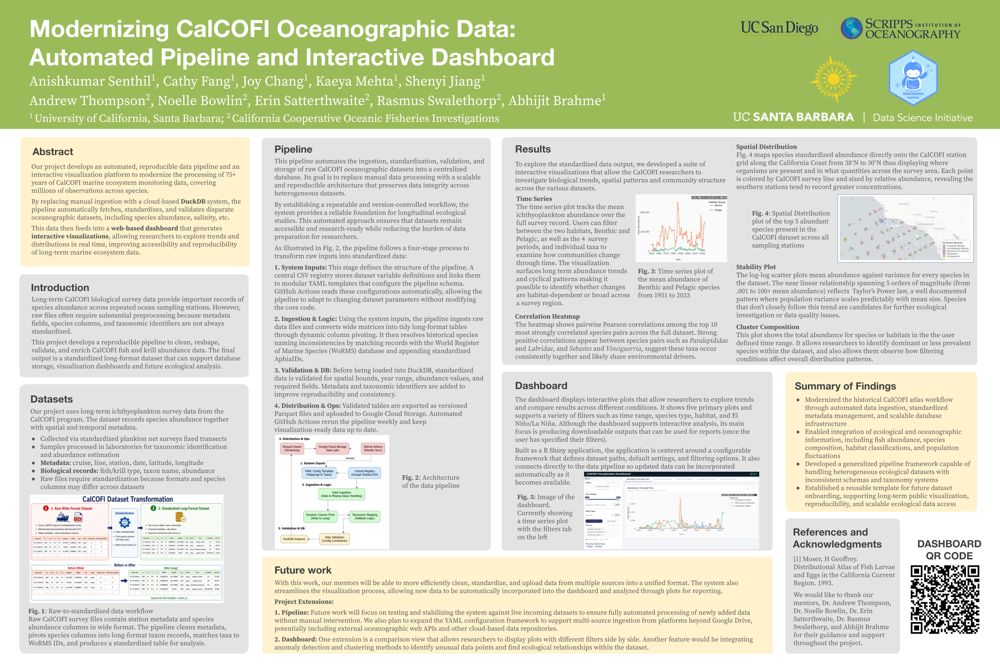
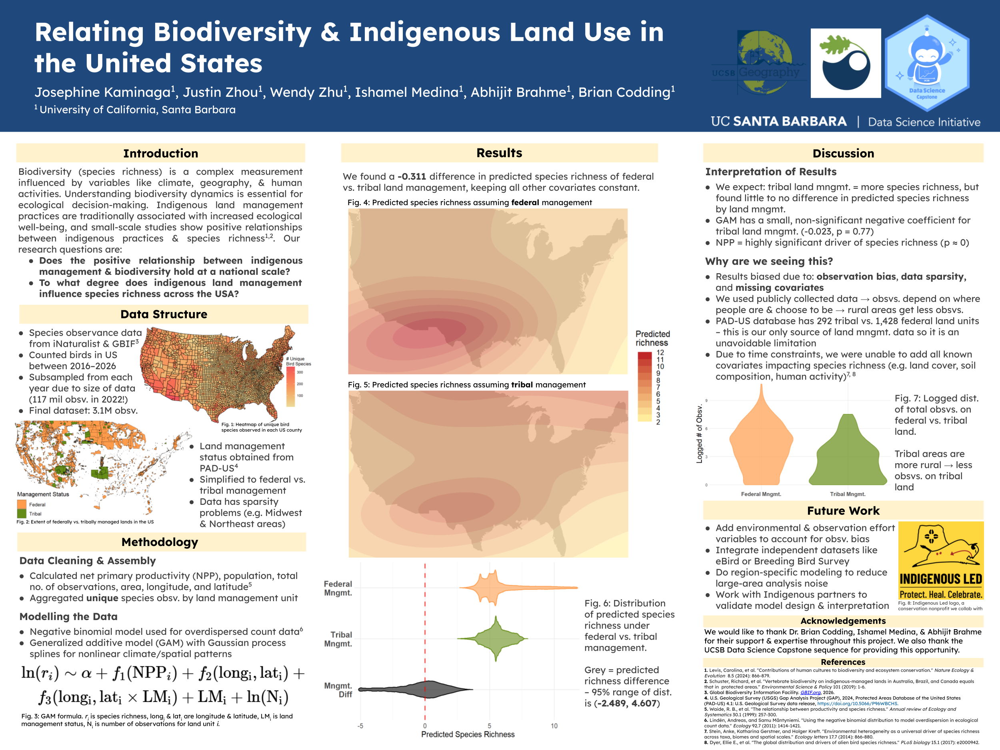
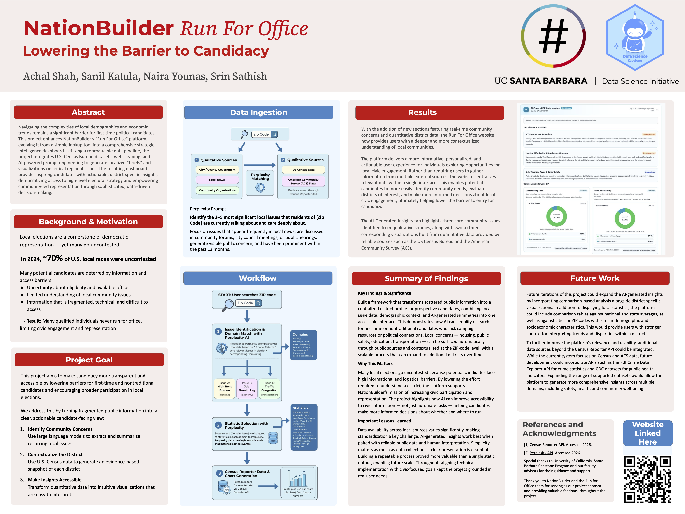
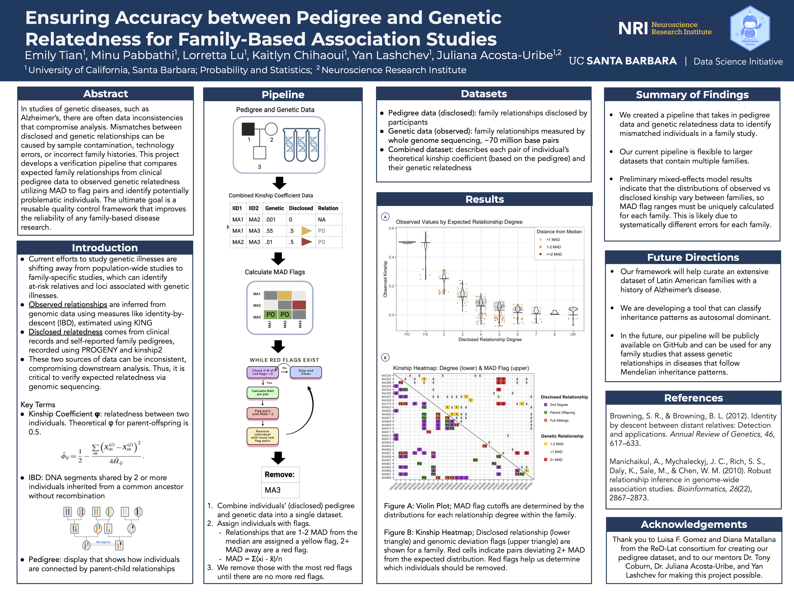
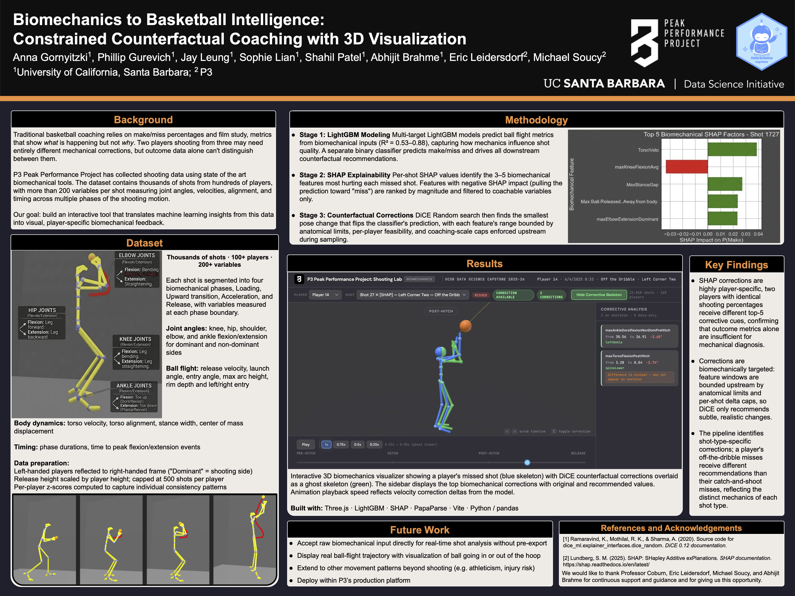

Listed alphabetically by project sponsor.

## BlueAlpha, Project 1

***Prior Sensitivity Analysis in Bayesian Marketing Mix Models***

**Student team:** Aidan Frazier, Jasper Luo, Quinlan Wilson, Jimmy Wu, Coraline Zhu
**Mentor:** *Cole Dillaplain, Oliver Mulkin, Ori Portat*

This project develops a structured prior sensitivity analysis framework for Bayesian Marketing Mix Models (MMM). Built on Google’s Meridian open-source MMM framework and prior calibration documentation [1,2], the analysis systematically varies channel-level prior assumptions while holding the dataset and model structure fixed. Drawing on prior Bayesian media mix modeling research [3], the framework measures how ROI, contribution, and channel rankings change across prior settings. The goal is to identify which marketing conclusions remain stable and which depend heavily on prior choices. An MMM is a statistical model that estimates how different advertising channels drive some key performance indicator such as ROI, conversions, or revenue. As modern MMMs become increasingly Bayesian, their results can depend heavily on priors. A prior represents the model’s starting belief about a channel before new data are observed. In the marketing context, the model then uses observed data such as spend, impressions, and subscriptions to update that belief into a posterior estimate. Our project studies how much that posterior changes when the starting prior changes.

::: column-screen

:::

---

## BlueAlpha, Project 2

***Synthetic Data Generation for Validating Marketing Mix Models***

**Student team:** Eitan Boaz, Andrew Guerra, Nathan Kim, Madhav Rao, Charles Yang
**Mentor:** *Olivier Mulkin, Ori Porat*

Marketing Mix Models (MMMs) are widely used for marketing budget allocation, but real‐world datasets are often noisy, proprietary, and lack known ground‐truth channel effects. In partnership with BlueAlpha, we developed a configurable synthetic marketing data generator that produces realistic, reproducible benchmark datasets for MMM evaluation. By preserving known ground‐truth parameters, the system enables controlled testing of MMM parameter recovery, robustness, and attribution accuracy. 

::: column-screen

:::

---

## BlueAlpha, Project 3

***Introducing Co-Channel Synergies into Marketing Mix Models***

**Student team:** Brooks Piper, Alex Morifusa, Sam Caruthers, Alex Dieter, Bahaar Ahuja
**Mentor:** *Ori Jonathan Porat, Cole Dillaplain, Olivier Mulkin*

In collaboration with BlueAlpha, we propose several mechanisms to introduce cross-channel synergies within Marketing Mix Models using Googleʼs Meridian framework: geometric mean transforms, spend-only models, and ROI reconciliation. By incorporating such terms that are otherwise commonly excluded, we better capture the underlying functionality of marketing campaigns. Modeling interactions with geometric means yielded the best predictive accuracy with an R-squared of 0.856, while the spend-only and rectification models had 0.843 and 0.780, respectively (against a baseline of 0.820).

::: column-screen

:::

---

## CalCOFI, CA Sea Grant, and Scripps Institute of Oceanography

***Improving Transparency: Interactive CalCOFI Data Access Portal***

**Student team:** Aashish Krishnan, Nicole Xu, Qiongwen (Lucy) Cao
**Mentor:** *Erin Satterthwaite*
**Advisors:** Tony Coburn

Develop a user-friendly, variable-based CalCOFI data discovery inventory that helps users quickly find where CalCOFI data reside across multiple repositories and platforms. Since CalCOFI is a distributed system of different data providers sampling on the CalCOFI platform this serves as a federated system. The tool will enable users to browse or search by variable, parameter type, or dataset and directly link to the appropriate data source for their need (e.g., across major repositories and data serving services – ERDDAP, OBIS, EDI, NCEI, program databases, and visualization tools). Because CalCOFI data are heterogeneous in format, stewardship, and delivery systems, it is not realistic to centralize all datasets within a single platform. Instead, the inventory will function as a navigation layer organized around standardized variable names and dataset descriptions, with clearly labeled links to landing pages, DOIs, dynamic services, and APIs.

::: column-screen

:::

---

## CalCOFI and Scripps Institute of Oceanography

***Modernizing CalCOFI Oceanographic Data: Automated Pipeline and Interactive Dashboard***

**Student team:** Anishkumar Senthil, Cathy Fang, Joy Chang, Kaeya Mehta, Shenyi Jiang
**Mentor:** *Andrew Thompson, Noelle Bowlin, Erin Satterthwaite, Rasmus Swalethorp*
**Advisors:** Abhijit Brahme

Our project develops an automated, reproducible data pipeline and an interactive visualization platform to modernize the processing of 75+ years of CalCOFI marine ecosystem monitoring data, covering millions of observations across species. By replacing manual ingestion with a cloud-based DuckDB system, the pipeline automatically fetches, standardizes, and validates disparate oceanographic datasets, including species abundance, salinity, etc. This data then feeds into a web-based dashboard that generates interactive visualizations, allowing researchers to explore trends and distributions in real time, improving accessibility and reproducibility of long-term marine ecosystem data.

Long-term CalCOFI biological survey data provide important records of species abundance across repeated ocean sampling stations. However, raw files often require substantial preprocessing because metadata fields, species columns, and taxonomic identifiers are not always standardized. This project develops a reproducible pipeline to clean, reshape, validate, and enrich CalCOFI fish and krill abundance data. The final output is a standardized long-format dataset that can support database storage, visualization dashboards and future ecological analysis.

::: column-screen

:::

---

## Brian Codding Lab

***Relating Biodiversity and Indigenous Land Use in the United States***

**Student team:** Josephine Kaminaga, Justin Zhou, Wendy Zhu
**Mentor:** *Brian Codding, Ishamel Medina*
**Advisors:** Abhijit Brahme

Biodiversity (species richness) is a complex measurement influenced by variables like climate, geography, & human activities. Understanding biodiversity dynamics is essential for ecological decision-making. Indigenous land management practices are traditionally associated with increased ecological well-being, and small-scale studies show positive relationships between indigenous practices & species richness1,2. Our research questions are: Does the positive relationship between indigenous management & biodiversity hold at a national scale? To what degree does indigenous land management influence species richness across the USA?

::: column-screen

:::

---

## NationBuilder

***NationBuilder Run For Office: Lowering the Barrier to Candidacy***

**Student team:** Achal Shah, Sanil Katula, Naira Younas, Srin Sathish
**Mentor:** *Michael Schmidt*

Navigating the complexities of local demographics and economic trends remains a significant barrier for first-time political candidates. This project enhances NationBuilder’s "Run For Office" platform, evolving it from a simple lookup tool into a comprehensive strategic intelligence dashboard. Utilizing a reproducible data pipeline, the project integrates U.S. Census Bureau datasets, web scraping, and AI-powered prompt engineering to generate localized "briefs" and visualizations on critical regional issues. The resulting dashboard provides aspiring candidates with actionable, district-specific insights, democratizing access to high-level electoral strategy and empowering community-led representation through sophisticated, data-driven decision-making.

::: column-screen

:::

---

## Neuroscience Research Institute

***Ensuring Accuracy Between Pedigree and Genetic Relatedness for Family-Based Association Studies***

**Student team:** Emily Tian, Minu Pabbathi, Loretta Lu, Kaitlyn Chihaoui
**Mentor:** *Juliana Acosta-Uribe*
**Advisor:** Yan Lashchev

In studies of genetic diseases, such as Alzheimer's, there are often data inconsistencies that compromise analysis. Mismatches between disclosed and genetic relationships can be caused by sample contamination, technology errors, or incorrect family histories. This project develops a verification pipeline that compares expected family relationships from clinical pedigree data to observed genetic relatedness utilizing MAD to flag pairs and identify potentially problematic individuals. The ultimate goal is a reusable quality control framework that improves the reliability of any family-based disease research.

::: column-screen

:::

---

## P3: Peak Performance Project

***Biomechanics to Basketball Intelligence: Constrained Counterfactual Coaching with 3D Visualization***

**Student team:** Anna Gornyitzki, Phillip Gurevich, Jay Leung, Sophie Lian, Shahil Patel
**Mentor:** *Eric Leidersdorf, Michael Soucy*
**Advisor:** Abhijit Brahme

Traditional basketball coaching relies on make/miss percentages and film study, metrics that show what is happening but not why. Two players shooting from three may need entirely different mechanical corrections, but outcome data alone can't distinguish between them. P3 Peak Performance Project has collected shooting data using state of the art biomechanical tools. The dataset contains thousands of shots from hundreds of players, with more than 200 variables per shot measuring joint angles, velocities, alignment, and timing across multiple phases of the shooting motion. Our goal: build an interactive tool that translates machine learning insights from this data into visual, player-specific biomechanical feedback.

::: column-screen

:::

---