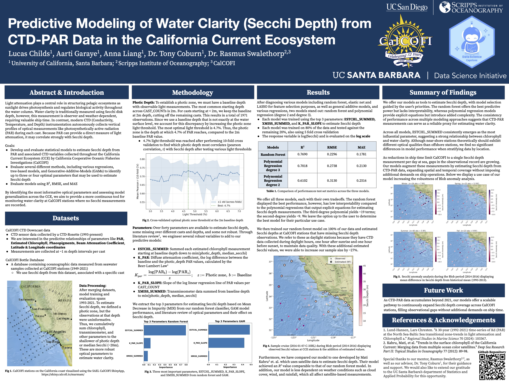
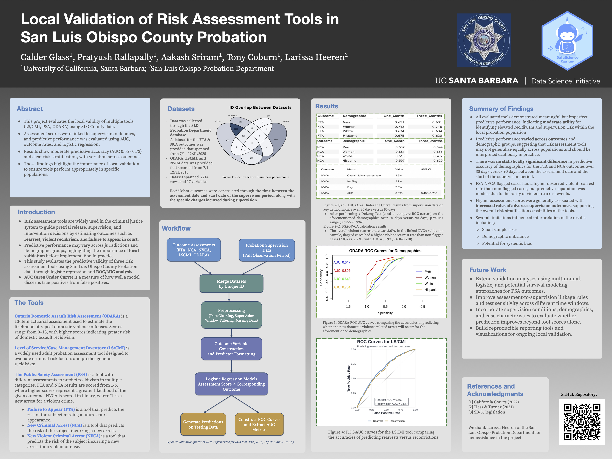
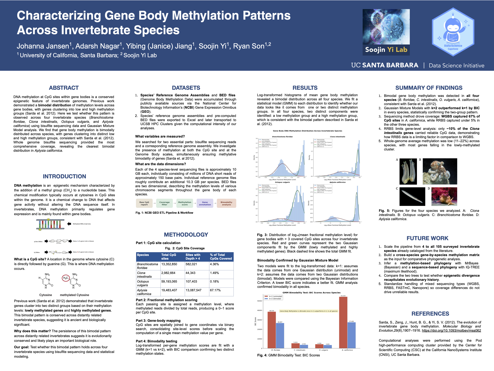
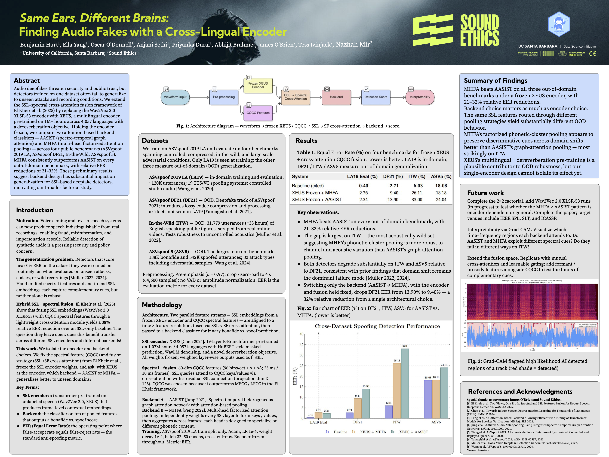

Listed alphabetically by project sponsor.

## BlueAlpha, Project 1

***Prior Sensitivity Analysis in Bayesian Marketing Mix Models***

**Student team:** Aidan Frazier, Jasper Luo, Quinlan Wilson, Jimmy Wu, Coraline Zhu
**Mentor:** *Cole Dillaplain, Ori Porat*
**Advisor:** Olivier Mulkin

This project develops a structured prior sensitivity analysis framework for Bayesian Marketing Mix Models (MMM). Built on Google’s Meridian open-source MMM framework and prior calibration documentation [1,2], the analysis systematically varies channel-level prior assumptions while holding the dataset and model structure fixed. Drawing on prior Bayesian media mix modeling research [3], the framework measures how ROI, contribution, and channel rankings change across prior settings. The goal is to identify which marketing conclusions remain stable and which depend heavily on prior choices. An MMM is a statistical model that estimates how different advertising channels drive some key performance indicator such as ROI, conversions, or revenue. As modern MMMs become increasingly Bayesian, their results can depend heavily on priors. A prior represents the model’s starting belief about a channel before new data are observed. In the marketing context, the model then uses observed data such as spend, impressions, and subscriptions to update that belief into a posterior estimate. Our project studies how much that posterior changes when the starting prior changes.

::: column-screen

:::

---

## BlueAlpha, Project 2

***Synthetic Data Generation for Validating Marketing Mix Models***

**Student team:** Eitan Boaz, Andrew Guerra, Nathan Kim, Madhav Rao, Charles Yang
**Mentor:** *Ori Porat*
**Advisor:** Olivier Mulkin

Marketing Mix Models (MMMs) are widely used for marketing budget allocation, but real‐world datasets are often noisy, proprietary, and lack known ground‐truth channel effects. In partnership with BlueAlpha, we developed a configurable synthetic marketing data generator that produces realistic, reproducible benchmark datasets for MMM evaluation. By preserving known ground‐truth parameters, the system enables controlled testing of MMM parameter recovery, robustness, and attribution accuracy. 

::: column-screen

:::

---

## BlueAlpha, Project 3

***Introducing Co-Channel Synergies into Marketing Mix Models***

**Student team:** Brooks Piper, Alex Morifusa, Sam Caruthers, Alex Dieter, Bahaar Ahuja
**Mentor:** *Ori Jonathan Porat, Cole Dillaplain*
**Advisor:** Olivier Mulkin

In collaboration with BlueAlpha, we propose several mechanisms to introduce cross-channel synergies within Marketing Mix Models using Googleʼs Meridian framework: geometric mean transforms, spend-only models, and ROI reconciliation. By incorporating such terms that are otherwise commonly excluded, we better capture the underlying functionality of marketing campaigns. Modeling interactions with geometric means yielded the best predictive accuracy with an R-squared of 0.856, while the spend-only and rectification models had 0.843 and 0.780, respectively (against a baseline of 0.820).

::: column-screen

:::

---

## CalCOFI, CA Sea Grant, and Scripps Institute of Oceanography

***Improving Transparency: Interactive CalCOFI Data Access Portal***

**Student team:** Aashish Krishnan, Nicole Xu, Qiongwen (Lucy) Cao
**Mentor:** *Erin Satterthwaite*
**Advisors:** Tony Coburn

Develop a user-friendly, variable-based CalCOFI data discovery inventory that helps users quickly find where CalCOFI data reside across multiple repositories and platforms. Since CalCOFI is a distributed system of different data providers sampling on the CalCOFI platform this serves as a federated system. The tool will enable users to browse or search by variable, parameter type, or dataset and directly link to the appropriate data source for their need (e.g., across major repositories and data serving services – ERDDAP, OBIS, EDI, NCEI, program databases, and visualization tools). Because CalCOFI data are heterogeneous in format, stewardship, and delivery systems, it is not realistic to centralize all datasets within a single platform. Instead, the inventory will function as a navigation layer organized around standardized variable names and dataset descriptions, with clearly labeled links to landing pages, DOIs, dynamic services, and APIs.

::: column-screen

:::

---

## CalCOFI and Scripps Institute of Oceanography

***Modernizing CalCOFI Oceanographic Data: Automated Pipeline and Interactive Dashboard***

**Student team:** Anishkumar Senthil, Cathy Fang, Joy Chang, Kaeya Mehta, Shenyi Jiang
**Mentor:** *Andrew Thompson, Noelle Bowlin, Erin Satterthwaite, Rasmus Swalethorp*
**Advisors:** Abhijit Brahme

Our project develops an automated, reproducible data pipeline and an interactive visualization platform to modernize the processing of 75+ years of CalCOFI marine ecosystem monitoring data, covering millions of observations across species. By replacing manual ingestion with a cloud-based DuckDB system, the pipeline automatically fetches, standardizes, and validates disparate oceanographic datasets, including species abundance, salinity, etc. This data then feeds into a web-based dashboard that generates interactive visualizations, allowing researchers to explore trends and distributions in real time, improving accessibility and reproducibility of long-term marine ecosystem data.

Long-term CalCOFI biological survey data provide important records of species abundance across repeated ocean sampling stations. However, raw files often require substantial preprocessing because metadata fields, species columns, and taxonomic identifiers are not always standardized. This project develops a reproducible pipeline to clean, reshape, validate, and enrich CalCOFI fish and krill abundance data. The final output is a standardized long-format dataset that can support database storage, visualization dashboards and future ecological analysis.

::: column-screen

:::

---

## Brian Codding Lab

***Relating Biodiversity and Indigenous Land Use in the United States***

**Student team:** Josephine Kaminaga, Justin Zhou, Wendy Zhu
**Mentor:** *Brian Codding, Ishamel Medina*
**Advisors:** Abhijit Brahme

Biodiversity (species richness) is a complex measurement influenced by variables like climate, geography, & human activities. Understanding biodiversity dynamics is essential for ecological decision-making. Indigenous land management practices are traditionally associated with increased ecological well-being, and small-scale studies show positive relationships between indigenous practices & species richness1,2. Our research questions are: Does the positive relationship between indigenous management & biodiversity hold at a national scale? To what degree does indigenous land management influence species richness across the USA?

::: column-screen

:::

---

## NationBuilder

***NationBuilder Run For Office: Lowering the Barrier to Candidacy***

**Student team:** Achal Shah, Sanil Katula, Naira Younas, Srin Sathish
**Mentor:** *Michael Schmidt*

Navigating the complexities of local demographics and economic trends remains a significant barrier for first-time political candidates. This project enhances NationBuilder’s "Run For Office" platform, evolving it from a simple lookup tool into a comprehensive strategic intelligence dashboard. Utilizing a reproducible data pipeline, the project integrates U.S. Census Bureau datasets, web scraping, and AI-powered prompt engineering to generate localized "briefs" and visualizations on critical regional issues. The resulting dashboard provides aspiring candidates with actionable, district-specific insights, democratizing access to high-level electoral strategy and empowering community-led representation through sophisticated, data-driven decision-making.

::: column-screen

:::

---

## Neuroscience Research Institute

***Ensuring Accuracy Between Pedigree and Genetic Relatedness for Family-Based Association Studies***

**Student team:** Emily Tian, Minu Pabbathi, Loretta Lu, Kaitlyn Chihaoui
**Mentor:** *Juliana Acosta-Uribe*
**Advisor:** Yan Lashchev

In studies of genetic diseases, such as Alzheimer's, there are often data inconsistencies that compromise analysis. Mismatches between disclosed and genetic relationships can be caused by sample contamination, technology errors, or incorrect family histories. This project develops a verification pipeline that compares expected family relationships from clinical pedigree data to observed genetic relatedness utilizing MAD to flag pairs and identify potentially problematic individuals. The ultimate goal is a reusable quality control framework that improves the reliability of any family-based disease research.

::: column-screen

:::

---

## P3: Peak Performance Project

***Biomechanics to Basketball Intelligence: Constrained Counterfactual Coaching with 3D Visualization***

**Student team:** Anna Gornyitzki, Phillip Gurevich, Jay Leung, Sophie Lian, Shahil Patel
**Mentor:** *Eric Leidersdorf, Michael Soucy*
**Advisor:** Abhijit Brahme

Traditional basketball coaching relies on make/miss percentages and film study, metrics that show what is happening but not why. Two players shooting from three may need entirely different mechanical corrections, but outcome data alone can't distinguish between them. P3 Peak Performance Project has collected shooting data using state of the art biomechanical tools. The dataset contains thousands of shots from hundreds of players, with more than 200 variables per shot measuring joint angles, velocities, alignment, and timing across multiple phases of the shooting motion. Our goal: build an interactive tool that translates machine learning insights from this data into visual, player-specific biomechanical feedback.

::: column-screen

:::

---

## Scripps Institute of Oceanography

***Predictive Modeling of Water Clarity (Secchi Depth) from CTD-PAR Data in the California Current Ecosystem***

**Student team:** Lucas Childs, Aarti Garaye, Anna Liang
**Mentor:** *Rasmus Swalethorp*
**Advisor:** Tony Coburn

Light attenuation plays a central role in structuring pelagic ecosystems as sunlight drives photosynthesis and regulates biological activity throughout the water column. Water clarity is traditionally measured using Secchi disk depth, however, this measurement is observer and weather-dependent, requiring valuable ship time. In contrast, modern CTD (Conductivity, Temperature, and Depth) instrumentation autonomously collects vertical profiles of optical measurements like photosynthetically active radiation (PAR) during each cast. Because PAR can provide a direct measure of light attenuation, it may correlate strongly with Secchi depth. Goals: Develop and evaluate statistical models to estimate Secchi depth from PAR and associated CTD variables collected throughout the California Current Ecosystem (CCE) by California Cooperative Oceanic Fisheries Investigations (CalCOFI). Evaluate several different methods, including various regressions, tree-based models, and Generative-Additive-Models (GAMs) to identify up to three or four optimal parameters that may be used to estimate Secchi depth. Evaluate models using R², RMSE, and MAE. By identifying the most informative optical parameters and assessing model generalization across the CCE, we aim to provide a more continuous tool for monitoring water clarity at CalCOFI stations where no Secchi measurements are recorded.

::: column-screen

:::

---

## Singularity Solutions

***Reconstruction of a Simulated Borehole from Unstructured Particle Data***

**Student team:** Satvik Talchuru, Akhil Gorla, Taneesha Panda
**Mentor:** *Zamir Syed*
**Advisor:** Olivier Mulkin

Geometric characterization of boreholes is a critical step for horizontal directional drilling (HDD) path-planning and reactive decision-making. This project addresses the challenge of reconstructing a smooth, continuous borehole surface from the noisy, unstructured 3D particle data generated by HDD simulations, in which the borehole exists only as a low-density void with no defined surface. We developed a slice-based pipeline that segments cross-sectional density fields, applies gradient-based candidate selection, and fits elliptical cross-sections using a RANSAC-based implementation robust to particle noise and outliers. Interpolation bridges gaps between valid slices, and aspect-ratio pre-filtering eliminates poor fits. The result is an exportable 3D mesh that reliably estimates borehole geometry and informs engineering decision-making in the field.

::: column-screen

:::

---

## San Luis Obispo County Probation Department

***Local Validation of Risk Assessment Tools in San Luis Obispo County Probation***

**Student team:** Calder Glass, Pratyush Rallapally, Aakash Sriram
**Mentor:** *Larissa Heeren*
**Advisor:** Tony Coburn

This project evaluates the local validity of multiple tools (LS/CMI, PSA, ODARA) using SLO County data. Assessment scores were linked to supervision outcomes, and predictive performance was evaluated using AUC, outcome rates, and logistic regression. Results show moderate predictive accuracy (AUC 0.55 - 0.72) and clear risk stratification, with variation across outcomes. These findings highlight the importance of local validation to ensure tools perform appropriately in specific populations.

Risk assessment tools are widely used in the criminal justice system to guide pretrial release, supervision, and intervention decisions by estimating outcomes such as rearrest, violent recidivism, and failure to appear in court. Predictive performance may vary across jurisdictions and demographic groups, highlighting the importance of local validation before implementation in practice. This study evaluates the predictive validity of three risk assessment tools using San Luis Obispo County Probation data through logistic regression and ROC/AUC analysis. AUC (Area Under Curve) is a measure of how well a model discerns true positives from false positives.

::: column-screen

:::

---

## Soojin Yi Lab

***Characterizing Gene Body Methylation Patterns Across Invertebrate Species***

**Student team:** Johanna Jansen, Adarsh Nagar, Yibing (Janice) Jiang
**Mentor:** *Soojin Yi, Ryan Son*

DNA methylation at CpG sites within gene bodies is a conserved epigenetic feature of invertebrate genomes. Previous work demonstrated a bimodal distribution of methylation levels across gene bodies, with genes clustering into low and high methylation groups (Sarda et al. 2012). Here we test whether this pattern is observed across four invertebrate species (Branchiostoma floridae, Ciona intestinalis, Octopus vulgaris, and Aplysia californica) using bisulfite sequencing data and Gaussian Mixture Model analysis. We find that gene body methylation is bimodally distributed across species, with genes clustering into distinct low and high methylation groups, consistent with Sarda et al. (2012). Whole genome bisulfite sequencing provided the most comprehensive coverage, revealing the clearest bimodal distribution in Aplysia californica.

::: column-screen

:::

---

## SoundEthics

***Same Ears, Different Brains: Finding Audio Fakes with a Cross-Lingual Encoder***

**Student team:** Benjamin Hurt, Ella Yang, Oscar O'Donnell, Anjani Sethi, Priyanka Durai
**Mentor:** *James O'Brien, Tess Ivinjack, Nazhah Mir*
**Advisor:** Abhijit Brahme

Audio deepfakes threaten security and public trust, but detectors trained on one dataset often fail to generalize to unseen attacks and recording conditions. We extend the SSL–spectral cross-attention fusion framework of El Kheir et al. (2025) by replacing the Wav2Vec 2.0 XLSR-53 encoder with XEUS, a multilingual encoder pre-trained on 1M+ hours across 4,057 languages with a dereverberation objective. Holding the encoder frozen, we compare two attention-based backend classifiers — AASIST (spectro-temporal graph attention) and MHFA (multi-head factorized attention pooling) — across four public benchmarks (ASVspoof 2019 LA, ASVspoof DF21, In-the-Wild, ASVspoof 5). MHFA consistently outperforms AASIST on every out-of-domain benchmark, with relative EER reductions of 21–32%. These preliminary results suggest backend design has substantial impact on generalization for SSL-based deepfake detectors, motivating our broader factorial study.

::: column-screen

:::

---